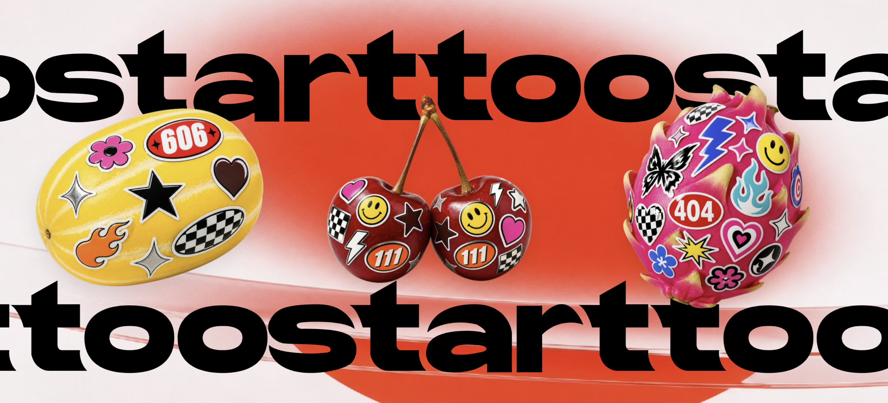
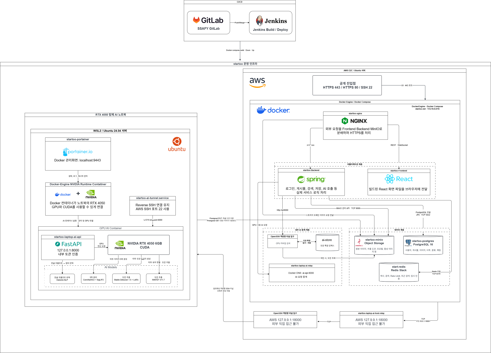

<!-- 배너 이미지: docs/images/banner.png 로 교체 -->

# 🐯 starttoo

> 타투를 시작하는 가장 쉬운 방법 — AR 시착, AI 도안 생성, 커버업 시뮬레이션까지.
> 타투가 처음인 사람과 타투이스트를 잇는 올인원 타투 플랫폼

<!-- 한 줄 소개는 팀에서 확정한 문구로 교체하세요 -->

- **서비스 URL**: <!-- https://stattoo.duckdns.org -->
- **서비스 소개 영상**: <!-- YouTube 링크 -->
- **시연 영상**: <!-- YouTube 링크 -->
- **개발 기간**: 2026.07 ~ 2026.08 (SSAFY 15기 공통 프로젝트)

---

## 👥 Team (D201 백두산 호랑이)

<!-- 사진: docs/images/member-이름.png (권장 비율 3:4, width로 크기 조절) -->

| 팀장 | 팀원1 | 팀원2 |
| :---: | :---: | :---: |
| 신지환 | 박범준 | 이한준 |
|  |  |  |
| `AI` AI 타투 도안 생성  · AR 타투 시뮬레이션 인프라 · 배포 | `FE` 커뮤니티 DM · 알림 | `BE` 인증 · 회원 커뮤니티 API |

| 팀원3 | 팀원4 | 팀원5 |
| :---: | :---: | :---: |
| 양혜림 | 심재훈 | 이효주 |
|  |  |  |
| `BE` 채팅 · 파일  | `AI` 타투 도안 생성 프롬프트 파이프라인 | `AI` 커버업 추천 이미지 처리 |

<!-- 인원수/담당은 실제에 맞게 수정 -->

---

## 💡 기획 배경

<!--
- 어떤 문제를 봤는지 (예: 타투는 지울 수 없어서 시작하기 두렵다)
- 왜 이 서비스인지 2~3문장
-->

---

## ✨ 주요 기능

### 1. AR 타투 시착

> 카메라로 내 몸에 타투를 실시간으로 얹어보고, 인물 분할 기반 마스크로 자연스럽게 합성

| 시착 화면 | 도안 조절 |
| :---: | :---: |
|  |  |

<!-- 짧은 시연은 mp4/GIF로:  -->

### 2. AI 타투 도안 생성

> 한국어 프롬프트를 번역·보강해 원하는 스타일의 타투 도안을 생성

| 프롬프트 입력 | 생성 결과 |
| :---: | :---: |
|  |  |

### 3. 커버업 시뮬레이션

> 기존 타투 사진 위에 직접 그려보고, 커버업 도안을 미리 확인

| 기존 타투 | 드로잉 | 커버업 결과 |
| :---: | :---: | :---: |
|  |  |  |

### 4. 타투이스트 커뮤니티 & DM

> 포트폴리오 탐색, 게시글·검색, 타투이스트와 1:1 실시간 상담

| 커뮤니티 | 검색 | DM |
| :---: | :---: | :---: |
|  |  |  |

<!-- 기능 개수·이름은 실제 서비스에 맞게 조정 -->

---

## 🛠 기술 스택

### Frontend
`React 19` `TypeScript` `Vite` `Tailwind CSS 4` `Zustand` `TanStack Query` `MediaPipe` `Transformers.js` `OpenCV.js` `STOMP`

### Backend
`Java 17` `Spring Boot` `Spring Security (OAuth2)` `JPA` `MySQL` `Redis` `WebSocket` `MinIO` `Firebase FCM`

### AI
`Python` `FastAPI` `PyTorch` `Diffusers` `Transformers` `Gemini API`

### Infra
`Docker` `Docker Compose` `Jenkins` `Nginx` `GitLab` `Jira`

<!-- 버전/항목은 실제 사용 기준으로 다듬기 -->

---

## 🏗 아키텍처

<!-- draw.io 등으로 그린 아키텍처 다이어그램 -->

---

## 📄 산출물

| 구분 | 링크 |
| :--- | :--- |
| 기획/요구사항 | <!-- 링크 --> |
| 화면 설계 (Figma) | <!-- 링크 --> |
| ERD | <!-- docs/images/erd.png 또는 링크 --> |
| API 명세 | <!-- Swagger 링크 --> |
| 포팅 매뉴얼 | <!-- docs/... --> |
| 팀 컨벤션 | [docs/CONVENTIONS.md](docs/CONVENTIONS.md) |
