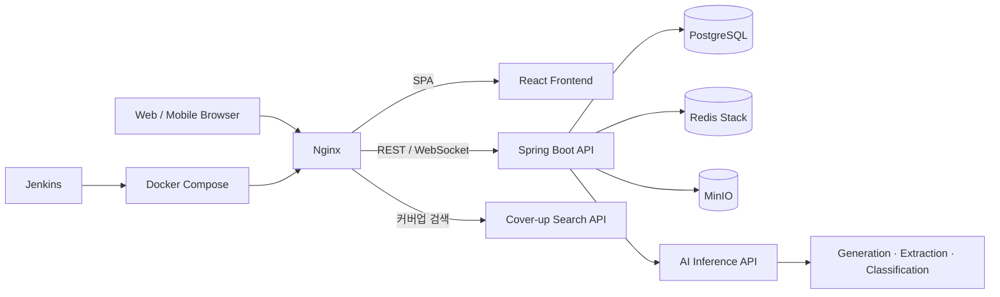

#  starttoo

> AI 도안 생성부터 AR/3D 시뮬레이션, 커버업 추천, 타투이스트 매칭까지. 
> 타투를 새기기로 결심한 순간부터 실제로 새기는 순간까지 전 과정을 하나로 연결하는 플랫폼

<!-- 한 줄 소개는 팀에서 확정한 문구로 교체하세요 -->

- **서비스 URL**: <!-- https://stattoo.duckdns.org -->
- **서비스 소개 영상**: <!-- YouTube 링크 -->
- **시연 영상**: <!-- YouTube 링크 -->
- **개발 기간**: 2026.07 ~ 2026.08 (SSAFY 15기 공통 프로젝트)

---

## 👥 Team (D201 백두산 호랑이)

<!-- 사진: docs/images/member-이름.png (권장 비율 3:4, width로 크기 조절) -->

| 팀장 | 팀원1 | 팀원2 |
| :---: | :---: | :---: |
| 신지환 | 박범준 | 이한준 |
| `AI/INFRA` | `BE` | `AI` |

| 팀원3 | 팀원4 | 팀원5 |
| :---: | :---: | :---: |
| 양혜림 | 심재훈 | 이효주 |
| `FE`| `FE` | `FE` |


---

## 💡 기획 배경

2027년 10월 문신 시술 합법화 시행을 앞두고 국내 타투 시장은 성장 국면에 진입한다. 그러나 시장 규모의 확대에 비해 이를 뒷받침할 디지털 인프라는 사실상 부재한 상태다.

타투 특성상, 한번 하면 평생 남기에 시술 전 확신이 필요하다. 하지만 현재는 결과를 미리 확인할 방법이 없다. 실제로 타투 미보유자 대상 설문에서 **평생 남는 것에 대한 두려움(79.1%)**, **자신의 몸에 어울릴지에 대한 불확실성(41.9%)**, **디자인 선택의 어려움(41.9%)**이 주요 진입 장벽으로 나타났다. 수요는 존재하나 불확실성이 실제 시술을 가로막고 있는 것이다.

이미 타투를 보유한 사용자도 사정은 다르지 않다. 예약·상담 채널은 **인스타그램 DM(72.7%)**, **카카오톡(45.5%)**, **전화·방문(27.3%)**으로 파편화되어 있어, 도안 탐색부터 상담과 예약까지 전 과정이 개인 SNS와 메신저에 흩어져 있다. 이를 통합할 전용 플랫폼이 없다는 뜻이다.

결국 두 집단의 문제는 **"시술 전에 확인할 방법이 없다"**와 **"한곳에서 해결할 곳이 없다"**로 수렴한다. 이에 생성형 AI·시뮬레이션·이미지 벡터 검색 기술을 결합해 AI 도안 생성부터 시뮬레이션, 커버업 추천, 도안 추출, 공유까지 하나의 흐름으로 묶은 **타투 올인원 서비스**를 기획했다.

> 설문조사 기간: 2026.07.13 ~ 07.15 / 총 128명(타투 보유자 11명) 대상

---

## ✨ 주요 기능

### 1. AI 타투 도안 생성

> 한국어 프롬프트를 번역·보강해 원하는 스타일의 타투 도안을 생성

| 프롬프트 입력 | 생성 결과 |
| :---: | :---: |
|  |  |

### 2. AR 시뮬레이션

> 카메라로 내 몸에 타투를 실시간으로 얹어보고, 인물 분할 기반 마스크로 자연스럽게 합성

| 소개 화면 | QR 연결 전 | QR 연결 후 | AR 결과 |
| :---: | :---: | :---: | :---: |
|  |  |  |  |

<!-- 짧은 시연은 mp4/GIF로:  -->

### 3. 3D 이미지 시뮬레이션

> 신체 사진을 올려 도안을 얹고, 몸의 굴곡을 따라 휘어진 모습으로 합성

| 신체 사진 선택 | 도안 선택 | 도안 정리 | 도안 합성 |
| :---: | :---: | :---: | :---: |
|  |  |  |  |


### 4. 커버업 도안 추천

> 기존 타투 사진 위에 직접 그려보고, 커버업 도안을 미리 확인

| 기존 타투 | 드로잉 | 커버업 결과 |
| :---: | :---: | :---: |
|  |  |  |


### 5. 낙서장 — 그린 모양으로 도안 찾기

> 홈에서 바로 열리는 줄노트에 원하는 모양을 그리면, 선의 형태를 닮은 도안을 찾아준다

가입도 신체 사진도 없이 낙서 한 장으로 도안만 보고 싶은 사람을 위한 입구다. 커버업과 같은 형태 검색 엔진을 쓰되, 그린 획을 검색 규격(420×520 마스크)으로 변환해 보낸다. 결과에서 바로 도안 보관함에 저장하거나 시뮬레이션으로 넘어갈 수 있다.

- **편집 도구**: 펜·지우개, 선 굵기 3단계, 되돌리기·다시 실행(`Ctrl/Cmd+Z`)
- **회전**: 15° 단위로 그림 전체를 돌려 도안 방향을 맞춘다. 돌리다 캔버스 밖으로 나가는 획이 생기면 넘치는 만큼만 자동으로 줄여 전체가 보이게 한다
- 결과를 보고 낙서장으로 돌아와도 그리던 그림이 그대로 남는다

<!-- 이미지: docs/images/doodle-draw.png, docs/images/doodle-result.png -->

### 6. 탐색 & 피드 & DM & 타투이스트 페이지

> 포트폴리오 탐색, 게시글·검색, 타투이스트와 1:1 실시간 상담

| 커뮤니티 | 검색 | DM |
| :---: | :---: | :---: |
|  |  |  |


<!-- 기능 개수·이름은 실제 서비스에 맞게 조정 -->

---

## 🛠 기술 스택


| 영역                 | 기술                                                                                            |
| ------------------ | --------------------------------------------------------------------------------------------- |
| **Frontend**       | React 19, TypeScript 5.8, Vite 7, React Router 7, Tailwind CSS 4, Zustand 5, TanStack Query 5 |
| **Browser Vision** | MediaPipe Tasks Vision, Transformers.js, OpenCV.js                                            |
| **Backend**        | Java 21, Spring Boot 3.5, Spring Security, Spring Data JPA, STOMP/WebSocket, Flyway           |
| **AI**             | Python 3.11, FastAPI, PyTorch, Diffusers, Transformers, Stable Diffusion 1.5, SigLIP2, OpenCV |
| **Data**           | PostgreSQL 16, Redis Stack, MinIO                                                             |
| **Infra**          | Docker, Docker Compose, Nginx, Jenkins, GitLab                                                |
| **External**       | Kakao·Google OAuth                                                                            |

---

## 🏗 시스템 아키텍처




- Nginx가 SPA, REST API, WebSocket, AI 요청을 단일 진입점에서 라우팅합니다.
- Spring Boot가 인증·사용자·게시물·컬렉션·DM·알림·미디어 도메인을 담당합니다.
- AI 서비스는 도안 생성·추출·분류 API와 커버업 전용 검색 엔진으로 분리되어 있습니다.
- PostgreSQL은 영속 데이터, Redis Stack은 캐시·검색·세션성 데이터, MinIO는 이미지 객체를 관리합니다.

---


## 📂 프로젝트 구조

```text
starttoo/
├── frontend/    # React 기반 사용자 웹 애플리케이션
├── backend/     # Spring Boot REST API 및 WebSocket 서버
├── ai/          # AI 추론 API와 커버업 도안 검색 엔진
├── nginx/       # 리버스 프록시 및 라우팅 설정
├── relay/       # 외부 GPU 머신 연결용 AI 릴레이
├── jenkins/     # Jenkins 실행 환경
├── docs/        # 컨벤션 및 README 이미지
├── exec/        # 빌드·배포·환경 변수 문서
├── docker-compose.yml
└── Jenkinsfile
```

---


## ERD


## 📄 산출물

| 구분 | 링크 |
| :--- | :--- |
| 기획/요구사항 | https://brief-vase-0fa.notion.site/39cb65bd273280c28e32f5d204fc897c |
| 화면 설계 (Figma) | https://brief-vase-0fa.notion.site/39cb65bd273280c28e32f5d204fc897c |
| API 명세 | https://brief-vase-0fa.notion.site/API_-3a4b65bd2732805bbe93cf1a066ba523?source=copy_link |
| 팀 컨벤션 | [docs/CONVENTIONS.md](docs/CONVENTIONS.md) |
